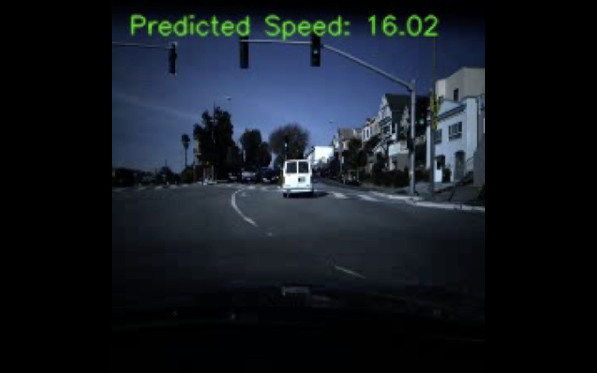
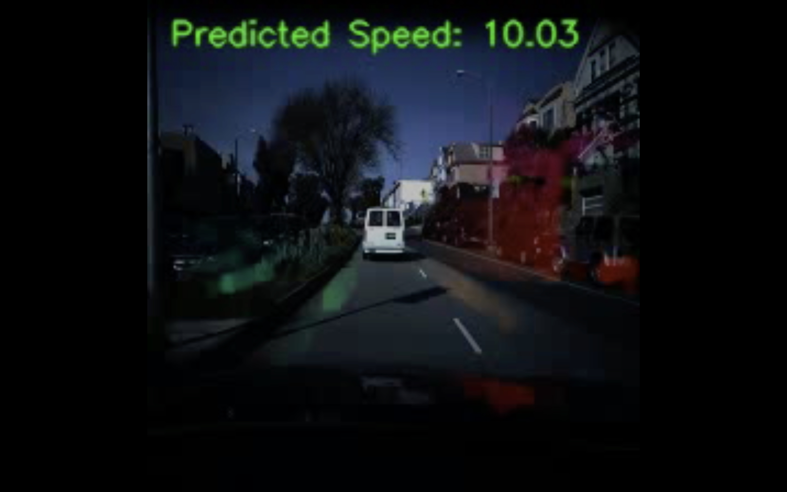

# Car Speed Estimation Using Optical Flow

### Project Description

This project focuses on estimating car speed from video data using optical flow and a convolutional neural network. The process involves the following key steps:

1. **Frame Extraction**: Frames are extracted from the input videos and saved for further analysis.

2. **Optical Flow Calculation**: Optical flow is computed between consecutive frames. This helps capture the motion of vehicles in the video.

3. **Dataset Preparation**: The frames and corresponding optical flow images are organized into datasets. A custom dataset class is used to load and preprocess these images.

4. **Model Training**: A convolutional neural network (CNN) is trained to predict car speed based on the input images. The model learns from both the raw frames and the optical flow images.

5. **Evaluation**: The model's performance is evaluated using mean absolute error on a test set.

6. **Prediction Visualization**: The trained model's predictions are visualized by overlaying estimated speeds on the video frames. Two types of output videos are created:
one showing `raw frames` with speed annotations and another with `optical flow` overlays.
---
### Sample
The final output includes videos that demonstrate the predicted speeds of vehicles, providing insights into the performance of the speed estimation model.

Here’s a preview of outputs:

---

Related Article : [Medium](https://medium.com/@selfouly/vehicle-speed-estimation-from-video-using-deep-learning-18b41babda4c)
